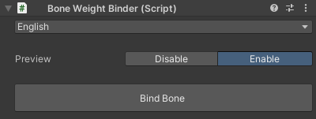

# `Bone Weight Binder` Component
A helper component in this tool.  
Here, you can fix the bindpose of the bone to which this component is attached, allowing it to be moved freely in the editor with newly assigned weights.

| Item | Description |
| --- | --- |
| Language | Selects the UI language. |
| Preview | Toggles the real-time preview. |
| Bind Bone | Fixes the bindpose of the bone to which the component is attached using the current pose. |
