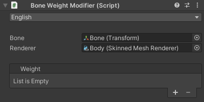

# `Bone Weight Modifier` Component
The only component in this tool.  
Here, you can set the target bone and renderer, and add or remove weights.

| Item | Description |
| --- | --- |
| Language | Selects the UI language. |
| Bone | Sets the target bone. If left unset, the target defaults to the object which the component is attached to. |
| Renderer | Sets the target renderer. |
| Weights | Adds or removes weights. For details, refer to the [Weights](./weights/). |
