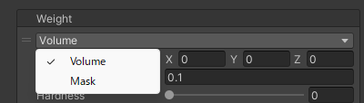

# Weights
Definitions of range and strength for applying bone weights.  
Here, you can assign new bone weights or overwrite existing ones.

| Item | Description |
| --- | --- |
| Volume | Applies bone weights using position and radius. For details, refer to the [Volume Weight](./volume-weight). |
| Mask | Applies bone weights using a mask texture. For details, refer to the [Mask Weight](./mask-weight). |
