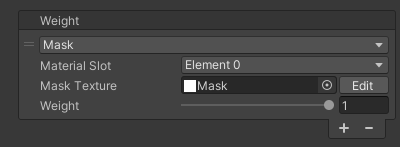
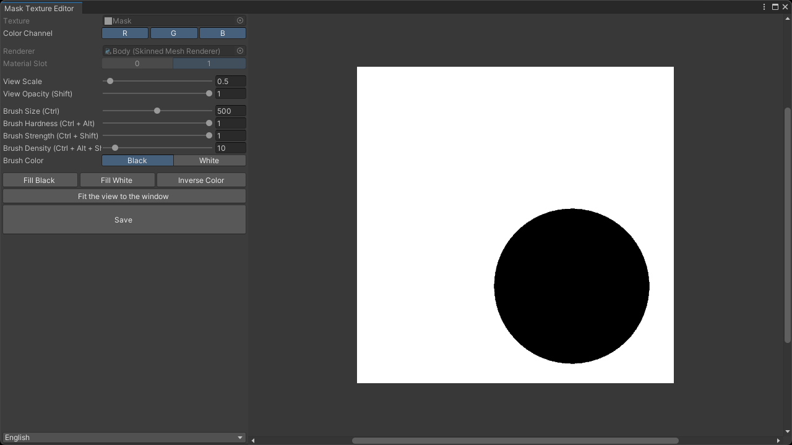

# `Mask` Weight
Applies bone weights using a mask texture.  
By applying a gradient to the mask texture or painting it darker, you can smoothly attenuate the influence near the boundary and adjust the blending rate with existing weights.

| Item | Description |
| --- | --- |
| Material Slot | Sets the material slot used to apply weights. |
| Mask Texture | Sets the mask texture used to apply weights. Darker colors preserve the existing weights strongly, while brighter values reflect this weights strongly. |
| Weight | Sets the value of the weight (influence of the bone) to be applied. |

> [!TIP]
> By installing the [Mask Texture Editor](https://github.com/nekobako/MaskTextureEditor), you can create and edit mask textures directly in the Unity Editor.

