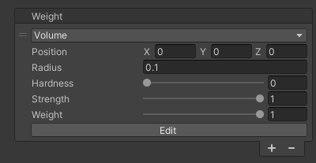
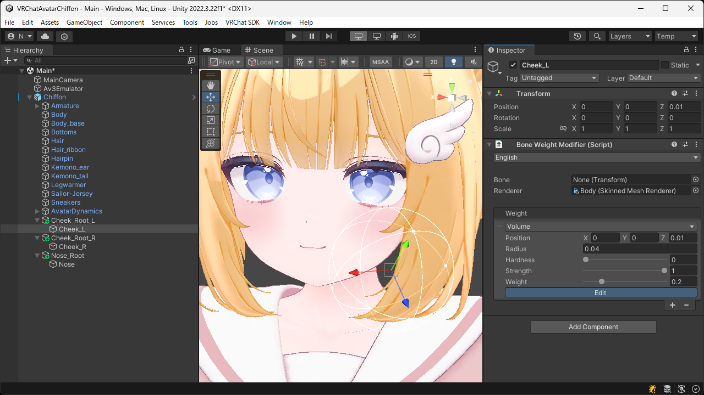

# `Volume` Weight
Applies bone weights using position and radius.  
By setting hardness and strength, you can smoothly attenuate the influence near the boundary and adjust the blending rate with existing weights.

| Item | Description |
| --- | --- |
| Position | Sets the position of the range where the weights to be applied. |
| Radius | Sets the radius of the range where the weights to be applied. |
| Hardness | Sets the attenuation rate of the weights from the center. Smaller values increase the attenuation, while larger values decrease it. |
| Strength | Sets the blending rate with existing weights. Smaller values preserve the existing weights strongly, while larger values reflect this weights strongly. |
| Weight | Sets the value of the weight (influence of the bone) to be applied. |

> [!TIP]
> By pressing the `Edit` button, you can adjust the position and radius directly in the Scene View.

