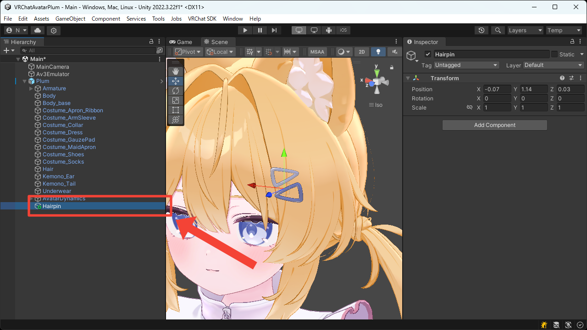
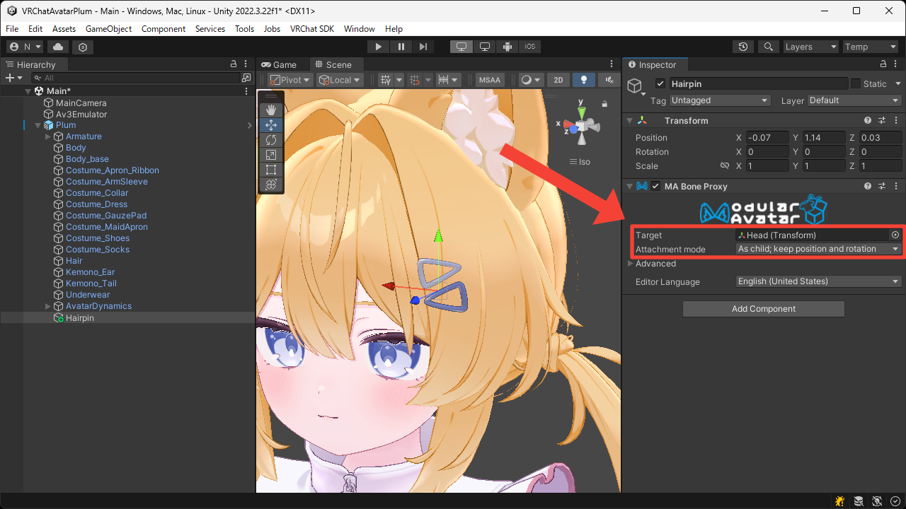
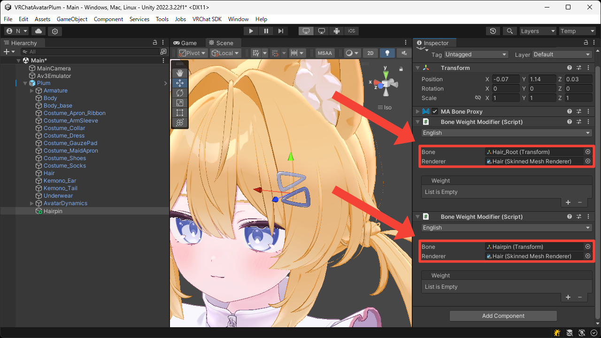
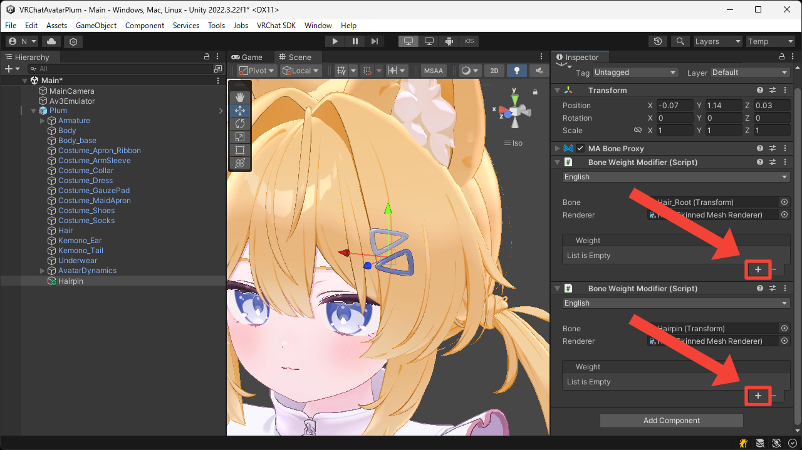
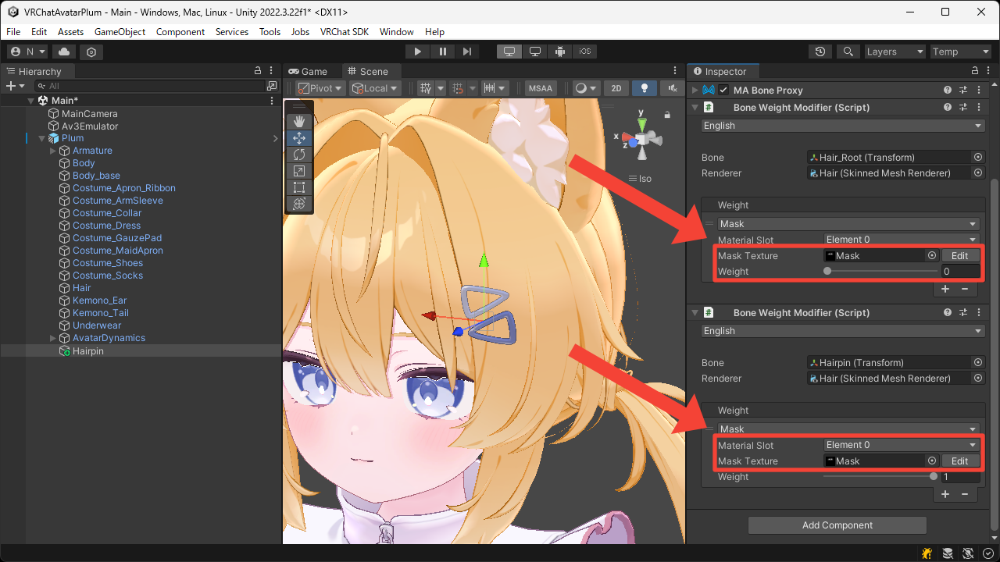

# Separate Accessories
This page explains how to separate the hairpin part from the hair mesh.

1. Create an empty Game Objects under the avatar root.  
This Game Object will later become the bone for the hairpin, so place it at the position of the hairpin.

2. Add the `MA Bone Proxy` component.

3. Set the `Target` to the `Head` bone, and set the `Attachment mode` to `As child; keep position and rotation` so that it moves under the `Head` bone while preserving its transform.

4. Add two `Bone Weight Modifier` components.  
The first is used to remove the existing bone weights, and the second is used to assign new ones.

5. Set the first `Bone` to the bone with existing weights, and set the second `Bone` to this Game Object.  
Also, set the both `Renderer` to the hair's `Skinned Mesh Renderer`.

6. Press the `+` button to add the `Mask` weights.

7. Set the both `Mask Texture` to the texture with only the hairpin area painted white.  
Also, set the first `Weight` to `0` and the second `Weight` to `1`.

8. Enter Play Mode to confirm that the hairpin part has been separated from the hair mesh.

<video muted autoplay loop playsinline src="../videos/tutorials/separate-accessories/separate-accessories.mp4"></video>
