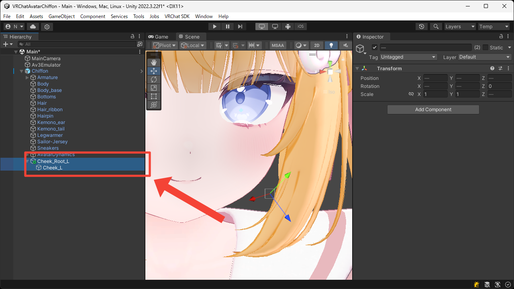
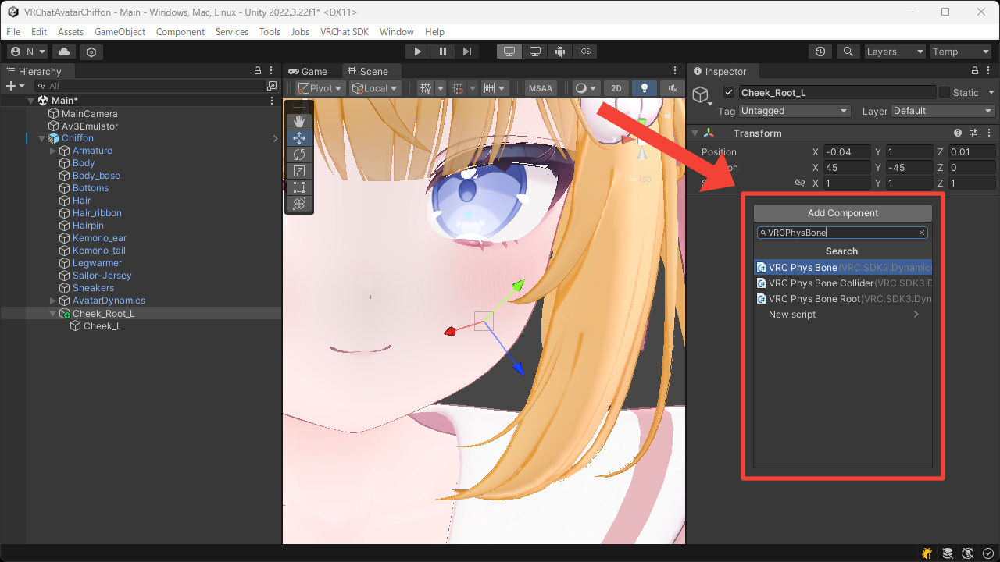
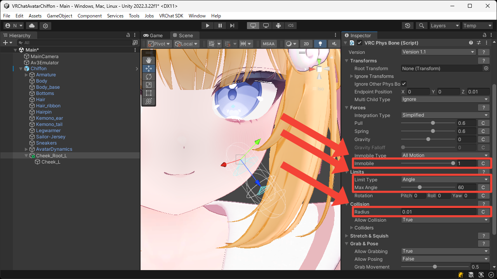
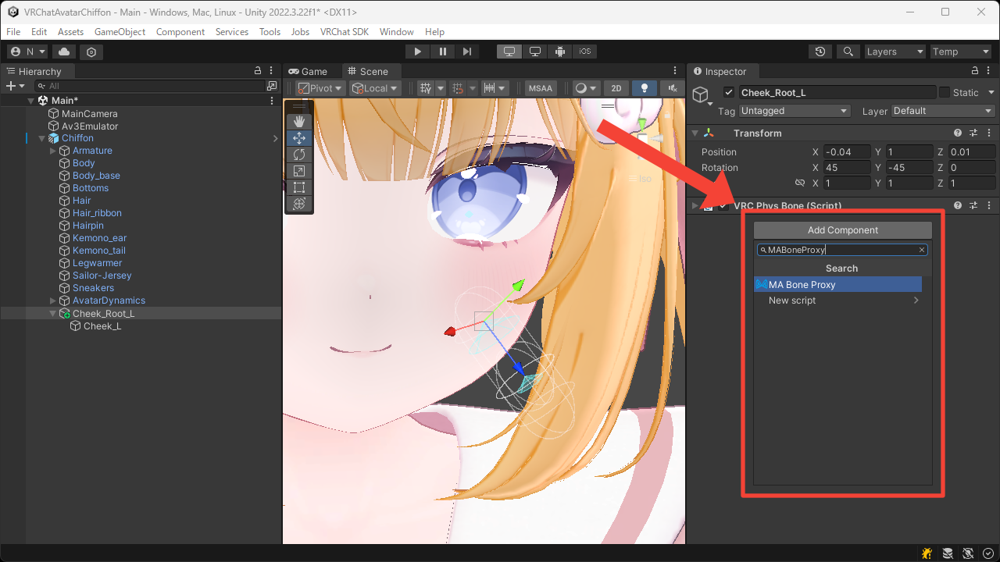
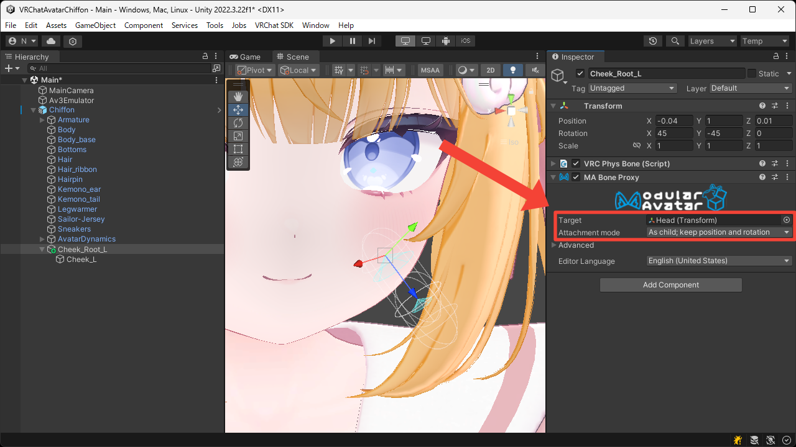
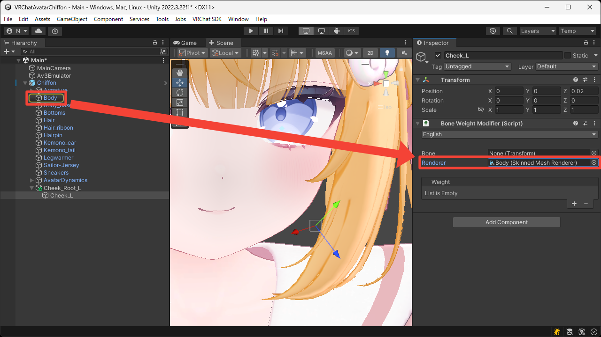
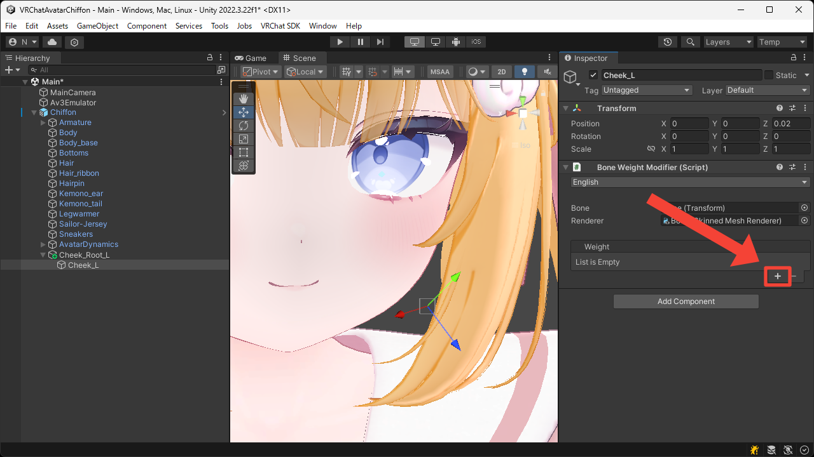
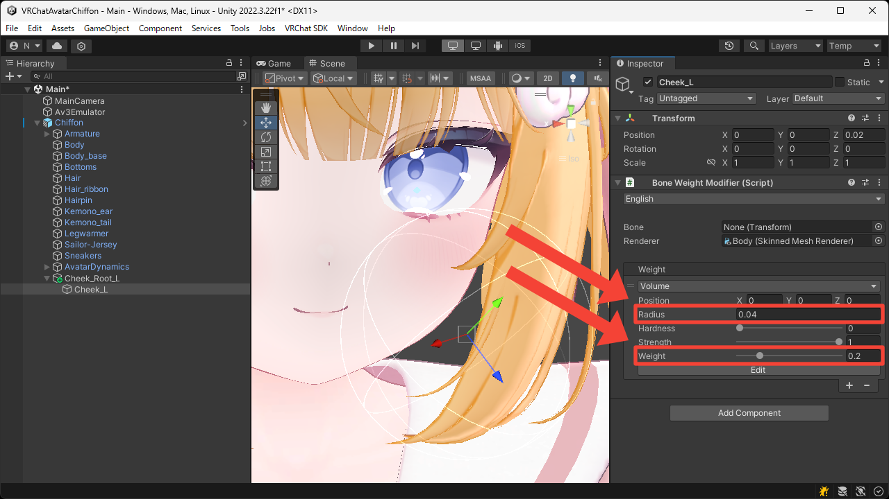

# Soft, Squishy Cheeks
This page explains how to add bone weights to the cheeks to make it soft and squishy.

1. Create nested empty Game Objects under the avatar root.  
Place the parent Game Object inside the face, and the child one at the tip of the cheek.

2. Add the `VRC Phys Bone` component to the parent Game Object.

3. Set an appropriate value for the `Collision > Radius` so it can be touched by hand, and set the `Forces > Immobile` to `1` so that the avatar's movement does not affect it.  
Also, to prevent it from bending too much when touched, set the `Limits > Limit Type` to `Angle` and set an appropriate value for the `Limits > Max Angle`.  
You can later adjust settings such as `Forces > Pull`, `Forces > Spring`, and `Transforms > Endpoint Position` to achieve better movement.

4. Add the `MA Bone Proxy` component to the parent Game Object.

5. Set the `Target` to the `Head` bone, and set the `Attachment mode` to `As child; keep position and rotation` so that it moves under the `Head` bone while preserving its transform.

6. Add the `Bone Weight Modifier` component to the child Game Object.

7. Set the `Renderer` to the face's `Skinned Mesh Renderer`.  
In this case, leave the `Bone` unset to apply the weight for this Game Object.

8. Press the `+` button to add the `Volume` weight.

9. Set the `Radius` so that it covers the area around one cheek.  
Also, set a lower `Weight` so that the bone's movement does not have too much influence.

10. Duplicate the bones created in the steps above and place it on the opposite side.

11. Enter Play Mode to confirm that the cheeks behave in a soft, squishy way in the Game View.

<video muted autoplay loop playsinline src="../videos/tutorials/soft-squishy-cheeks/soft-squishy-cheeks.mp4"></video>
