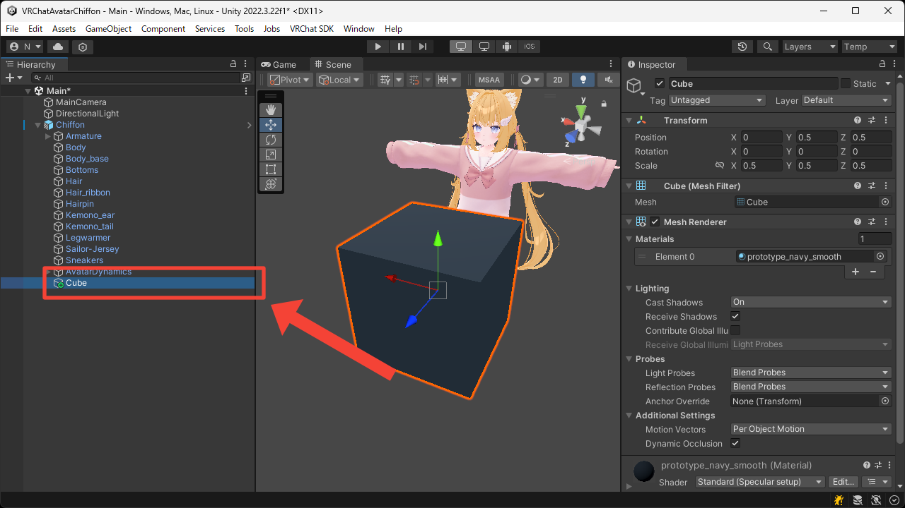
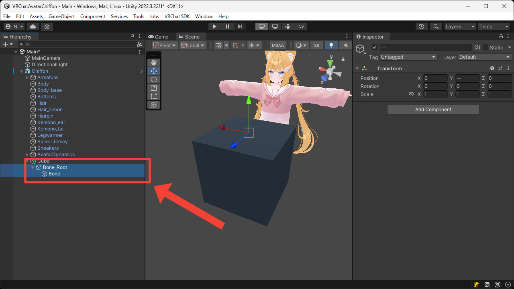
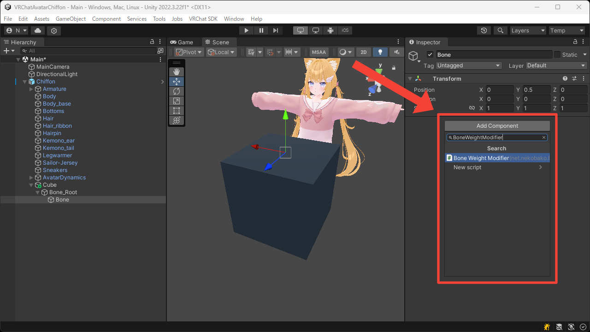
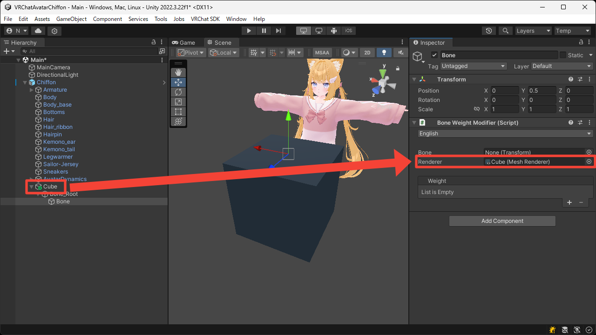
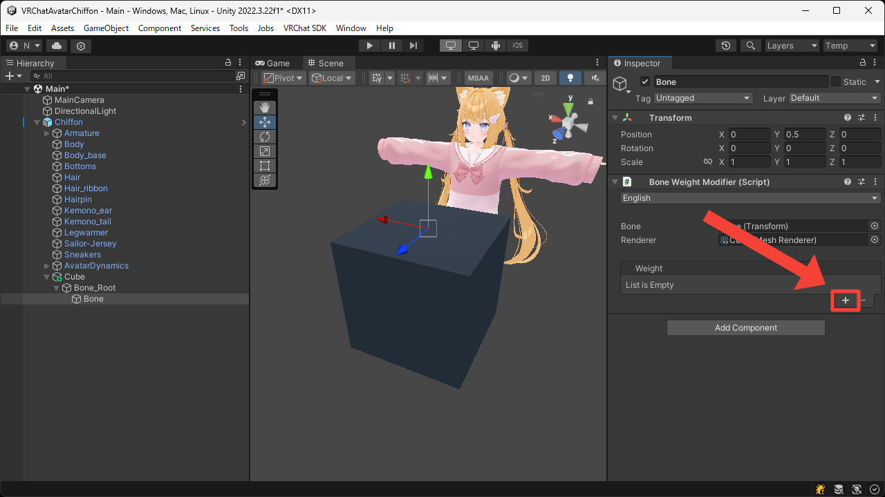
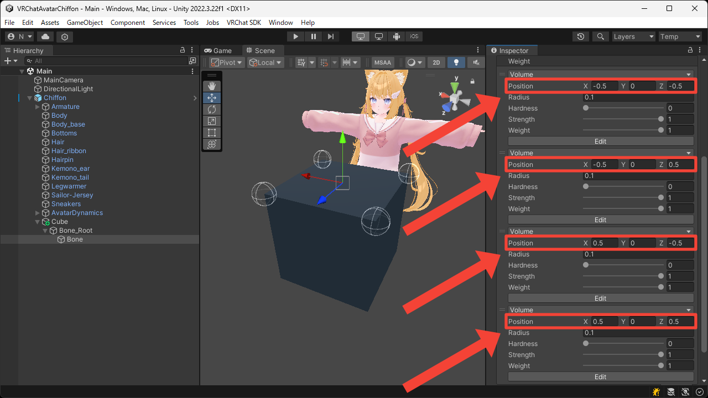

# Soft, Squishy Cube
This page explains how to add bone weights to the cube to make it soft and squishy.

1. Right-click the avatar root and create a cube from `3D Object > Cube`.

2. Create nested empty Game Objects under the cube.  
Place the parent Game Object inside the cube, and the child one at the top of the cube.

3. Add the `VRC Phys Bone` component to the parent Game Object.

4. Adjust settings such as `Forces > Pull` and `Forces > Spring` as you like.

5. Add the `Bone Weight Modifier` component to the child Game Object.

6. Set the `Renderer` to the cube's `Mesh Renderer`.  
In this case, leave the `Bone` unset to apply the weight for this Game Object.

7. Press the `+` button to add four `Volume` weight.

8. Set the `Position` of each one so that they are located at the top corners of the cube.

9. Enter Play Mode to confirm that the cube behaves in a soft, squishy way in the Game View.

<video muted autoplay loop playsinline src="../videos/tutorials/soft-squishy-cube/soft-squishy-cube.mp4"></video>
