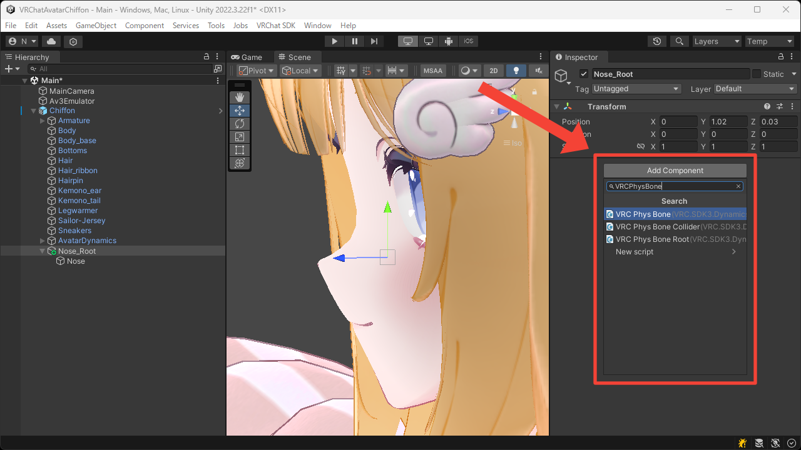
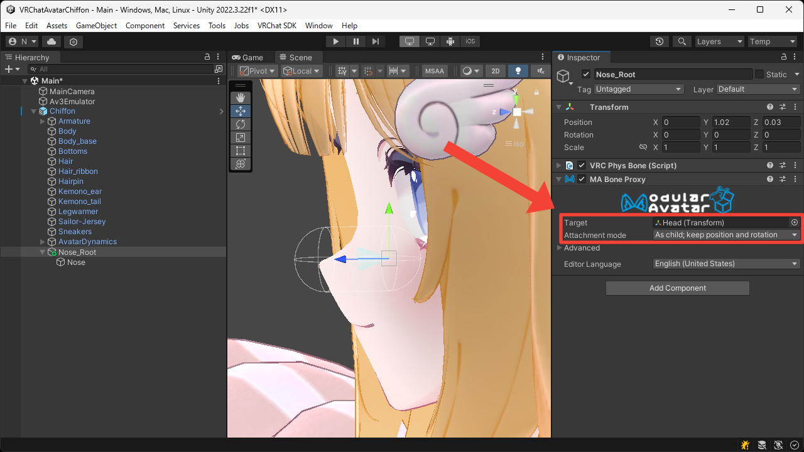
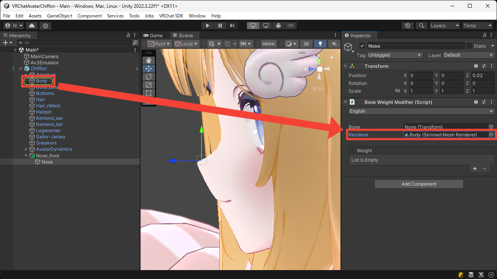
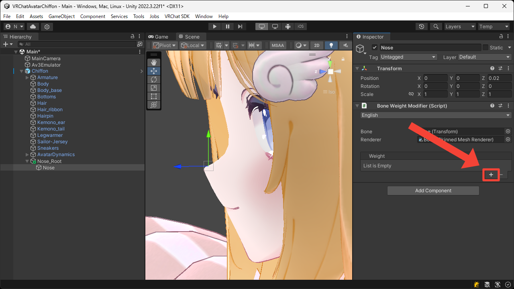
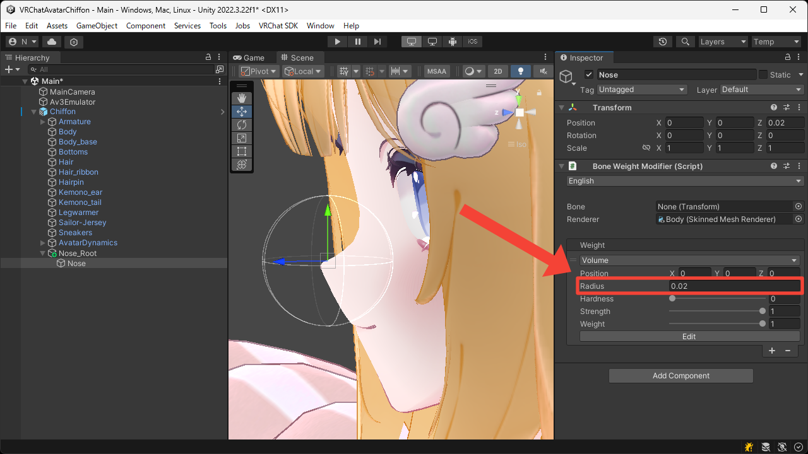

# Soft, Squishy Nose
This page explains how to add bone weights to the nose to make it soft and squishy.

1. Create nested empty Game Objects under the avatar root.  
These Game Objects will later become bones, so place it accordingly.

2. Add the `VRC Phys Bone` component to the outer Game Object.

3. Set an appropriate value for the `Collision > Radius` so it can be touched by hand, and set the `Forces > Immobile` to `1` so that the avatar's movement does not affect it.  
Also, to prevent it from bending too much when touched, set the `Limits > Limit Type` to `Angle` and set an appropriate value for the `Limits > Max Angle`.

4. Add the `MA Bone Proxy` component to the outer Game Object.

5. Set the `Target` to the `Head` bone, and set the `Attachment mode` to `As child; keep position and rotation` so that it moves under the `Head` bone while preserving its transform.

6. Add the `Bone Weight Modifier` component to the inner Game Object.

7. Set the `Renderer` to the face mesh's `Skinned Mesh Renderer`.  
In this case, leave the `Bone` unset to apply the weight for this Game Object.

8. Press the `+` button to add the `Volume` weight.

9. Set the `Radius` so that it covers the area around the nose.

10. Enter Play Mode to confirm that the nose behaves in a soft, squishy way in the Game View.

<video muted autoplay loop playsinline src="../videos/tutorials/soft-squishy-nose/soft-squishy-nose.mp4"></video>
