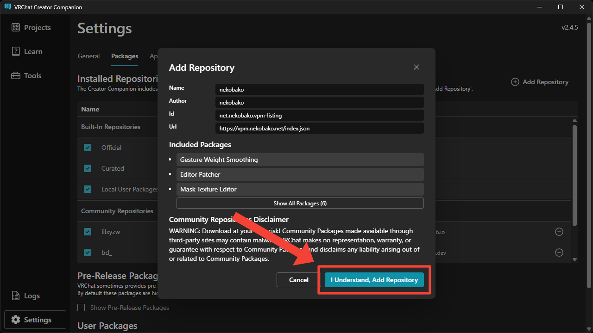
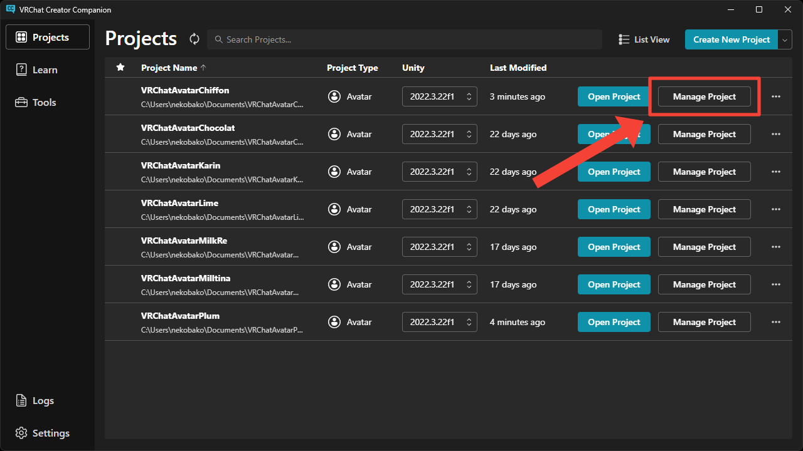

# インストール
このページではツールのインストール方法について説明します。

1. [こちらのリンク](vcc://vpm/addRepo?url=https://vpm.nekobako.net/index.json) から VCC を開いてリポジトリを追加します。

2. プロジェクトの `Manage Project` ボタンを押します。

3. `Bone Weight Modifier` パッケージの右にある `+` ボタンを押します。

