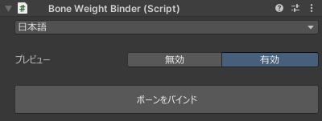

# `Bone Weight Binder` コンポーネント
本ツールの補助コンポーネントです。  
このコンポーネントがアタッチされているボーンのバインドポーズを固定し、エディタ上で新規のウェイトを伴って自由に動かせるようにします。

| 項目 | 説明 |
| --- | --- |
| 言語 | UI の言語を選択します。 |
| プレビュー | リアルタイムプレビューの無効/有効を切り替えます。 |
| ボーンをバインド | コンポーネントがアタッチされているボーンのバインドポーズを現在の姿勢で固定します。 |
