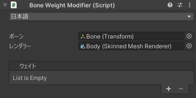

# `Bone Weight Modifier` コンポーネント
本ツール唯一のコンポーネントです。  
対象のボーンとレンダラーを設定し、ウェイトを追加/削除します。

| 項目 | 説明 |
| --- | --- |
| 言語 | UI の言語を選択します。 |
| ボーン | 対象のボーンを設定します。設定しない場合、コンポーネントがアタッチされているオブジェクトが対象となります。 |
| レンダラー | 対象のレンダラーを設定します。 |
| ウェイト | ウェイトを追加/削除します。詳しくは [ウェイト](./weights/) を参照してください。 |
