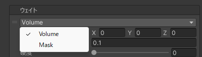

# ウェイト
ボーンウェイトを適用する範囲や強さの定義です。  
新規のボーンウェイトを割り当てたり既存のボーンウェイトを上書きしたりします。

| 項目 | 説明 |
| --- | --- |
| Volume | 位置と半径を使用してボーンウェイトを適用します。詳しくは [Volume ウェイト](./volume-weight) を参照してください。 |
| Mask | マスクテクスチャーを使用してボーンウェイトを適用します。詳しくは [Mask ウェイト](./mask-weight) を参照してください。 |
