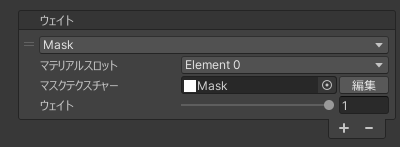
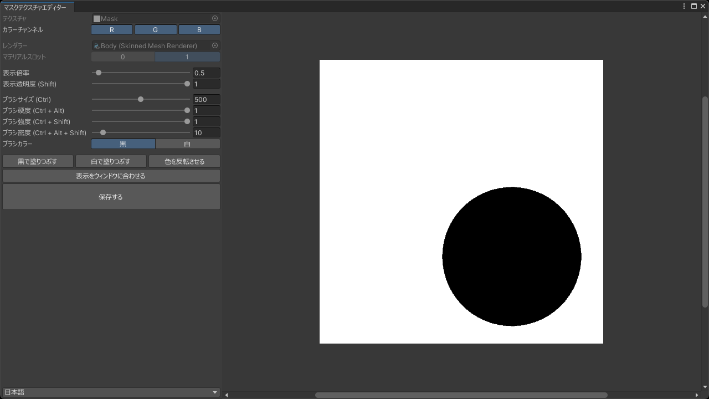

# `Mask` ウェイト
マスクテクスチャーを使用してボーンウェイトを適用します。  
マスクテクスチャーにグラデーションを付けたり暗めに塗ったりすることで、境界部分の影響を滑らかに減衰させたり既存のウェイトとのブレンド率を調整したりできます。

| 項目 | 説明 |
| --- | --- |
| マテリアルスロット | ウェイトの適用に使用するマテリアルスロットを設定します。 |
| マスクテクスチャー | ウェイトの適用に使用するマスクテクスチャーを設定します。暗いほど既存のウェイトを強く残し、明るいほどこのウェイトを強く反映します。 |
| ウェイト | 適用するウェイトの値 (ボーンの影響度) を設定します。 |

> [!TIP]
> [マスクテクスチャエディター](https://github.com/nekobako/MaskTextureEditor) をインストールすると Unity エディター上でマスクテクスチャーを直接作成/編集できます。

