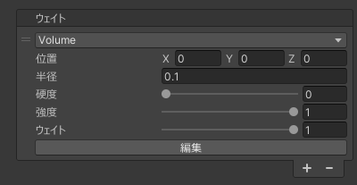
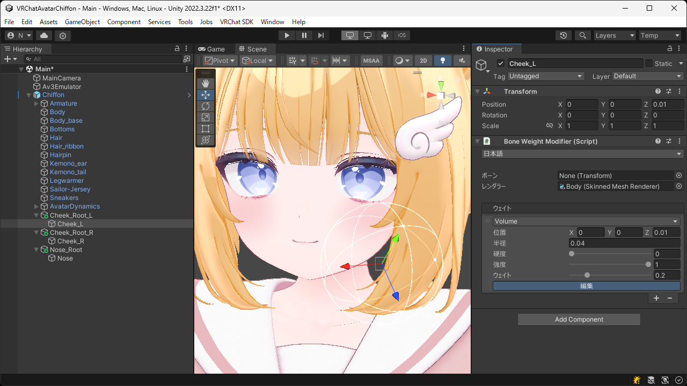

# `Volume` ウェイト
位置と半径を使用してボーンウェイトを適用します。  
硬度や強度を設定することで、境界部分の影響を滑らかに減衰させたり既存のウェイトとのブレンド率を調整したりできます。

| 項目 | 説明 |
| --- | --- |
| 位置 | ウェイトを適用する範囲の位置を設定します。 |
| 半径 | ウェイトを適用する範囲の半径を設定します。 |
| 硬度 | 中心からのウェイトの減衰率を設定します。小さいほど減衰し、大きいほど減衰しなくなります。 |
| 強度 | 既存のウェイトとのブレンド率を設定します。小さいほど既存のウェイトを強く残し、大きいほどこのウェイトを強く反映します。 |
| ウェイト | 適用するウェイトの値 (ボーンの影響度) を設定します。 |

> [!TIP]
> `編集` ボタンを押すとシーンビュー上で位置と半径を直接調整できます。

