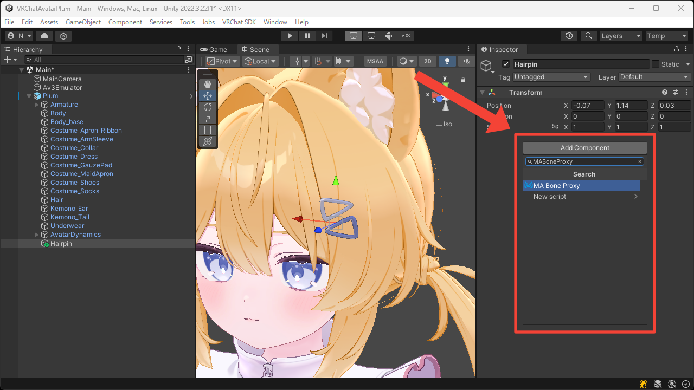
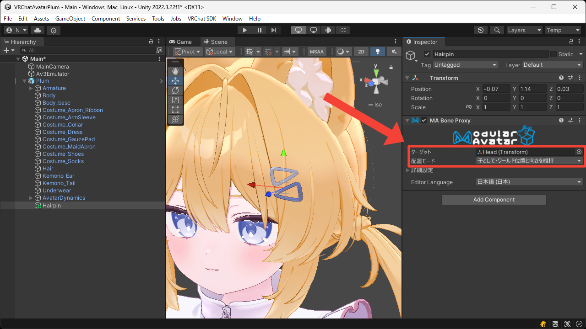
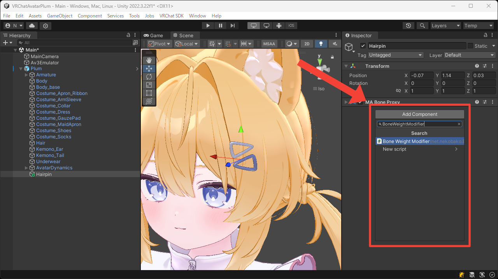
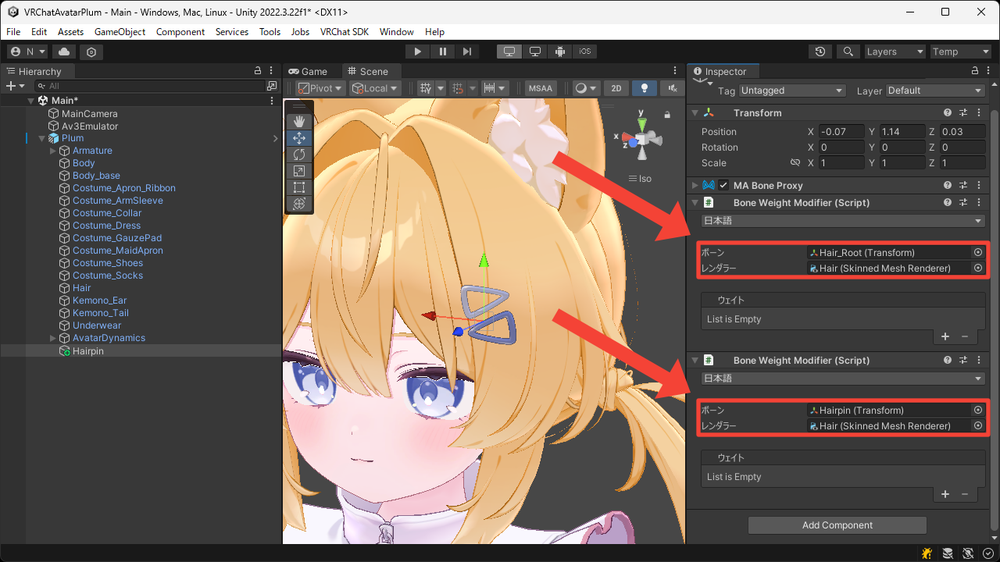
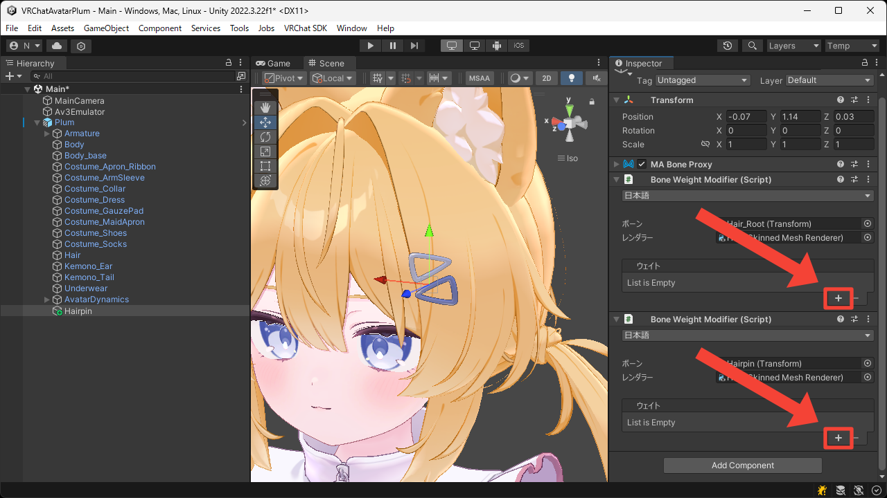
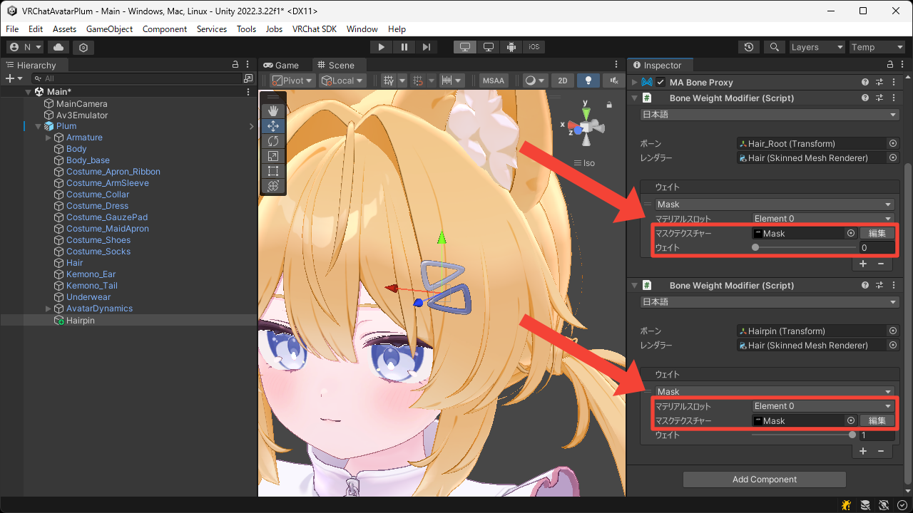

# アクセサリの分離
このページでは髪メッシュからヘアピン部分を分離する方法について説明します。

1. 空の Game Object をアバタールートの中に作成します。  
この Game Object が後にヘアピンのボーンとなるため、ヘアピンの位置に配置しています。

2. `MA Bone Proxy` コンポーネントを追加します。

3. `ターゲット` に `Head` ボーンを設定し、そのまま `Head` ボーンの子に移動するよう `配置モード` を `子として・ワールド位置と向きを維持` にします。

4. `Bone Weight Modifier` コンポーネントを 2 つ追加します。  
1 つ目は既存のボーンウェイトを削除するために使用し、2 つ目は新規のボーンウェイトを割り当てるために使用します。

5. 1 つ目の `ボーン` には既存のウェイトが乗ったボーンを設定し、2 つ目の `ボーン` にはこの Game Object を設定します。  
また、両方の `レンダラー` に髪の `Skinned Mesh Renderer` を設定します。

6. `+` ボタンを押して `Mask` ウェイトを追加します。

7. 両方の `マスクテクスチャー` にヘアピン部分だけを白く塗ったテクスチャーを設定します。  
また、1 つ目の `ウェイト` には `0` を設定し、2 つ目の `ウェイト` には `1` を設定します。

8. Play Mode に入って髪メッシュからヘアピン部分が分離されていることを確認します。

<video muted autoplay loop playsinline src="../videos/tutorials/separate-accessories/separate-accessories.mp4"></video>
