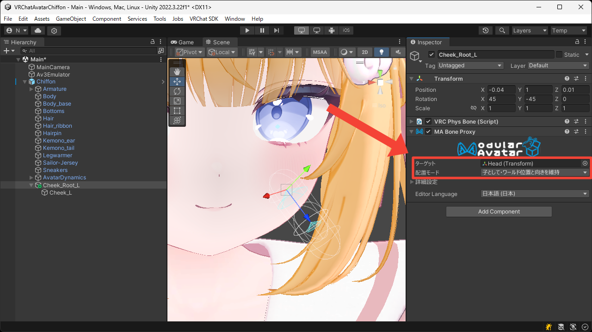
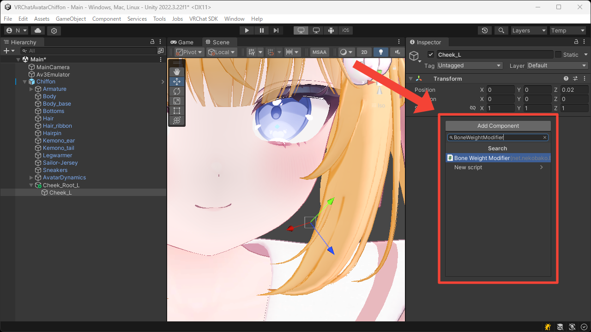
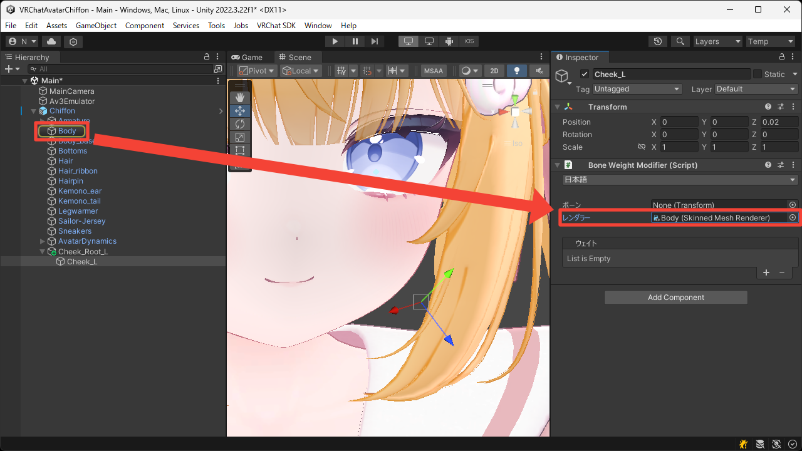
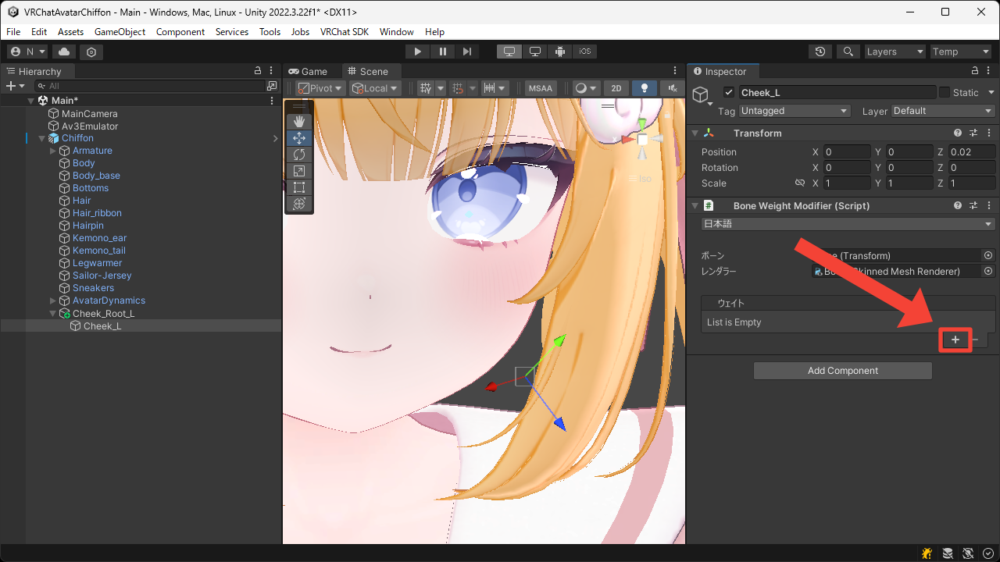
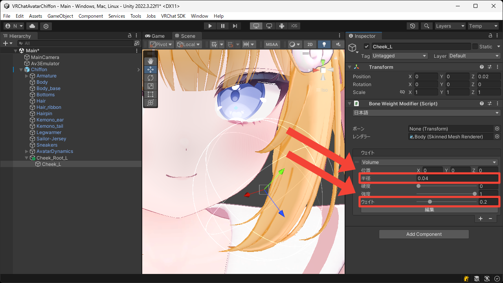
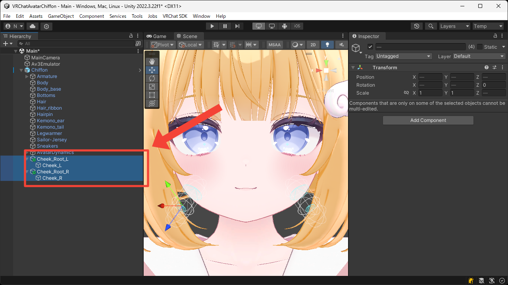

# もちもちのほっぺ
このページではほっぺにボーンウェイトを追加してもちもちにする方法について説明します。

1. 入れ子になった空の Game Object をアバタールートの中に作成します。  
親の Game Object を顔の内側に、子の Game Object をほっぺの先に配置しています。

2. 親の Game Object に `VRC Phys Bone` コンポーネントを追加します。

3. 手で触れられるよう `Collision > Radius` に適切な値を設定し、アバターの移動が影響しないよう `Forces > Immobile` に `1` を設定します。  
また、触れられたときに曲がりすぎないよう `Limits > Limit Type` を `Angle` にして `Limits > Max Angle` に適切な値を設定します。  
後から `Forces > Pull` や `Forces > Spring`、`Transforms > Endpoint Position` などの設定を調整することで、より良い動きを目指すことができます。

4. 親の Game Object に `MA Bone Proxy` コンポーネントを追加します。

5. `ターゲット` に `Head` ボーンを設定し、そのまま `Head` ボーンの子に移動するよう `配置モード` を `子として・ワールド位置と向きを維持` にします。

6. 子の Game Object に `Bone Weight Modifier` コンポーネントを追加します。

7. `レンダラー` に顔の `Skinned Mesh Renderer` を設定します。  
今回はこの Game Object を対象としてウェイトを適用するため、`ボーン` は未設定のままにしています。

8. `+` ボタンを押して `Volume` ウェイトを追加します。

9. 片側のほっぺの周りを覆うよう `半径` を設定します。  
また、ボーンの動きが影響しすぎないよう `ウェイト` を小さくしておきます。

10. ここまでの手順で作成したボーンを複製して反対側に配置します。

11. Play Mode に入って Game View でほっぺがもちもちできることを確認します。

<video muted autoplay loop playsinline src="../videos/tutorials/soft-squishy-cheeks/soft-squishy-cheeks.mp4"></video>
