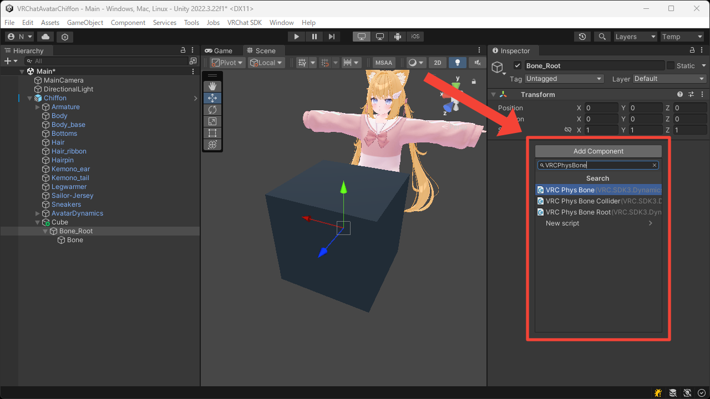
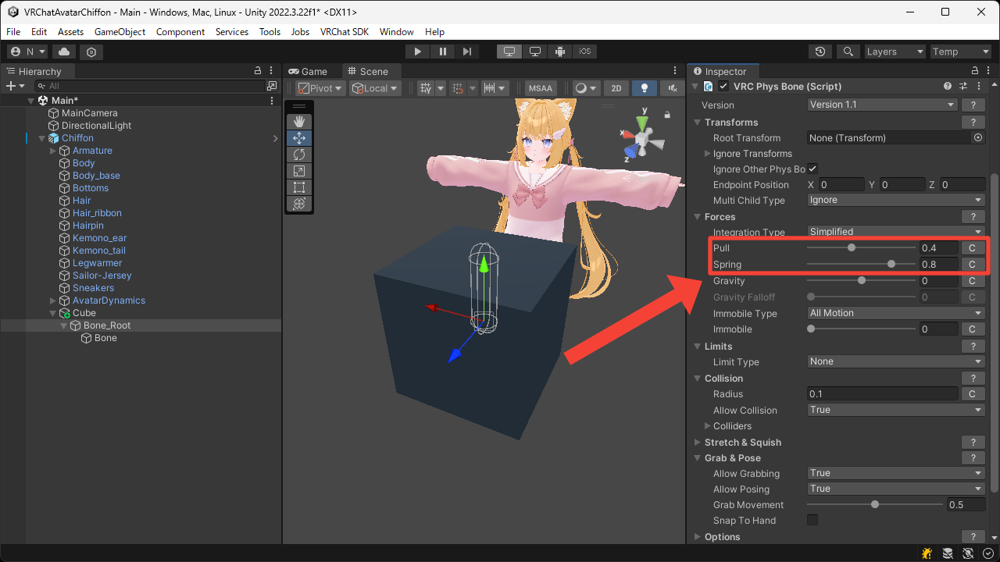
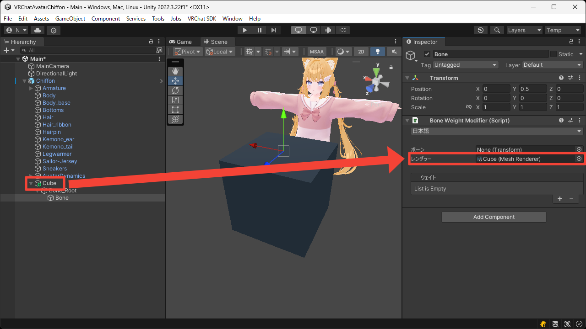
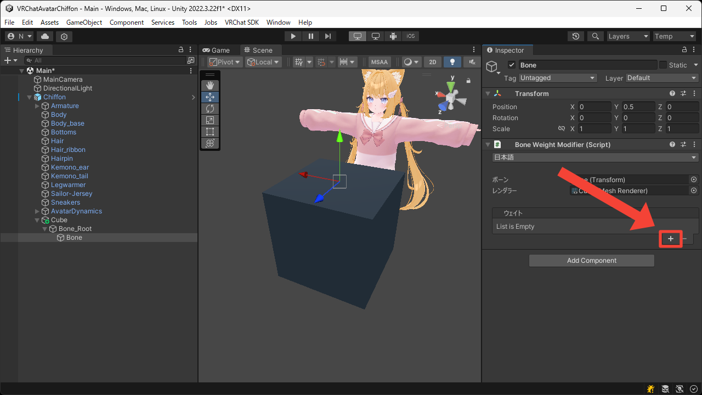
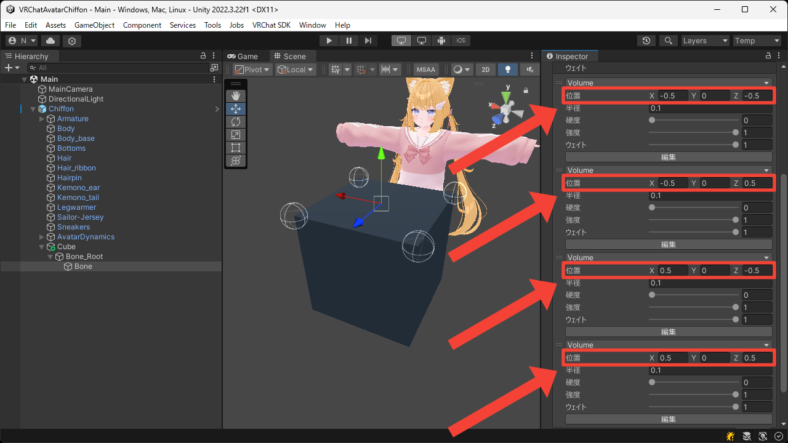

# ぷるぷるのキューブ
このページではキューブにボーンウェイトを追加してぷるぷるにする方法について説明します。

1. アバタールートを右クリックして `3D Object > Cube` からキューブを作成します。

2. 入れ子になった空の Game Object をキューブの中に作成します。  
親の Game Object をキューブの内側に、子の Game Object をキューブの上側に配置しています。

3. 親の Game Object に `VRC Phys Bone` コンポーネントを追加します。

4. `Forces > Pull` や `Forces > Spring` などの設定をいい感じに調整します。

5. 子の Game Object に `Bone Weight Modifier` コンポーネントを追加します。

6. `レンダラー` にキューブの `Mesh Renderer` を設定します。  
今回はこの Game Object を対象としてウェイトを適用するため、`ボーン` は未設定のままにしています。

7. `+` ボタンを押して `Volume` ウェイトを 4 つ追加します。

8. それぞれがキューブの上面の角に来るように `位置` を設定します。

9. Play Mode に入って Game View でキューブがぷるぷるすることを確認します。

<video muted autoplay loop playsinline src="../videos/tutorials/soft-squishy-cube/soft-squishy-cube.mp4"></video>
