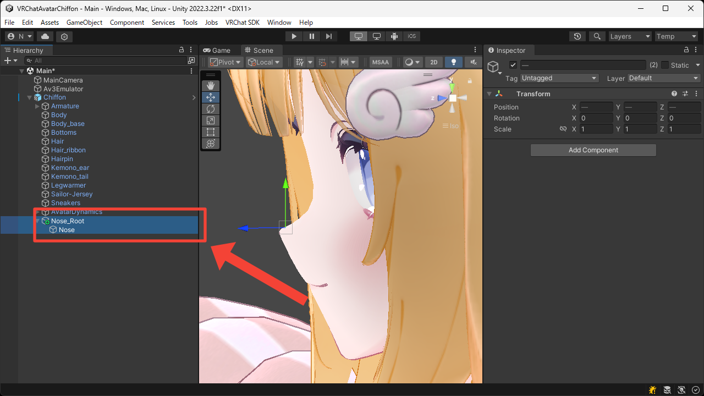
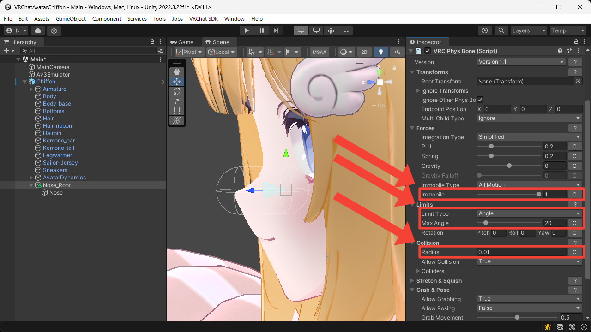
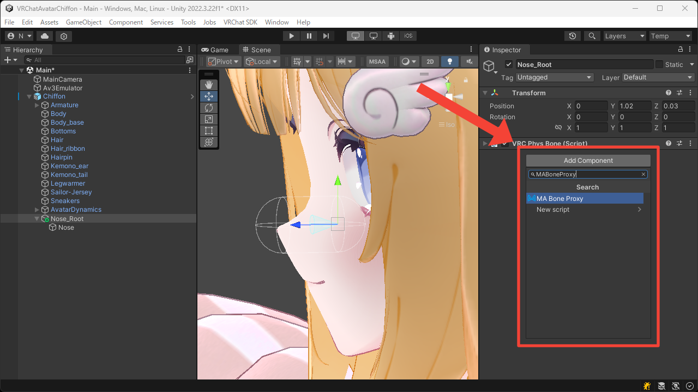
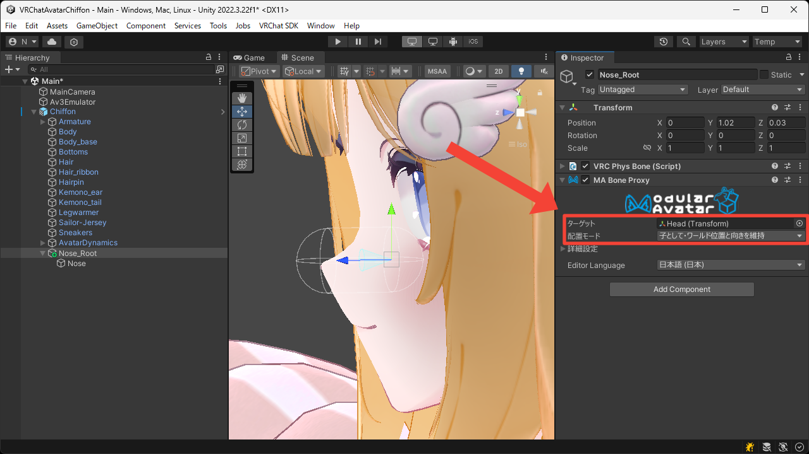
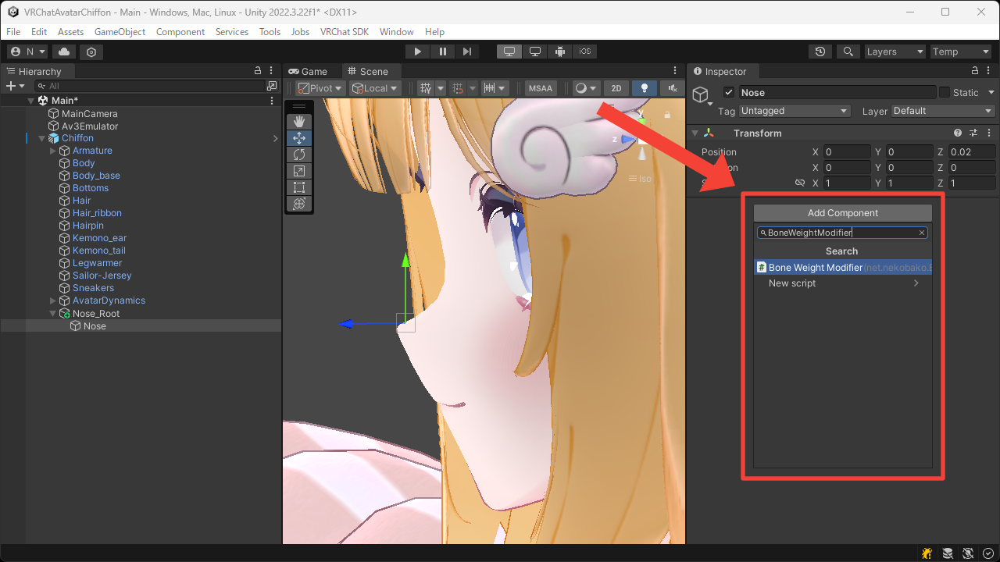
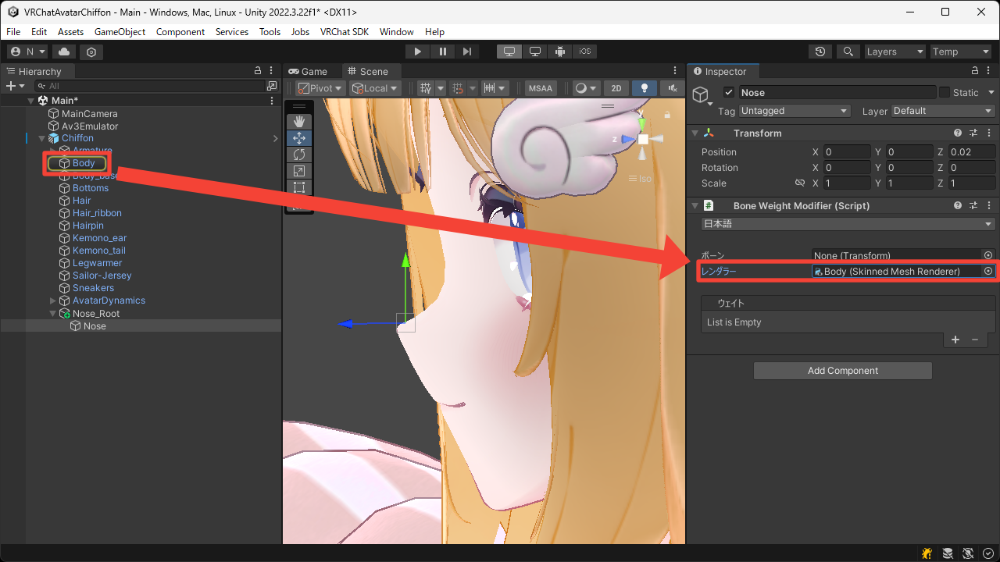
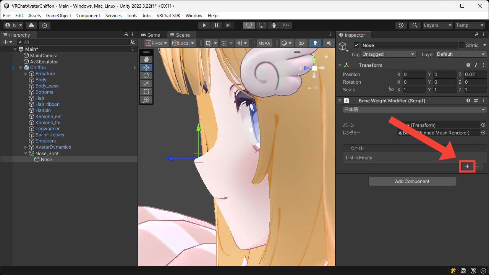
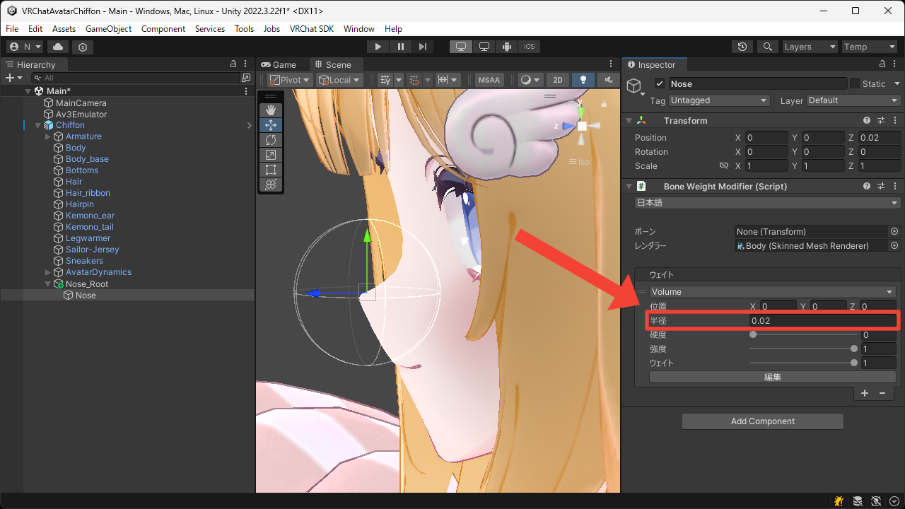

# ふにふにのおはな
このページではおはなにボーンウェイトを追加してふにふににする方法について説明します。

1. 入れ子になった空の Game Object をアバタールートの中に作成します。  
この Game Object が後にボーンとなるため、それを前提とした位置に配置します。

2. 外側の Game Object に `VRC Phys Bone` コンポーネントを追加します。

3. 手で触れられるよう `Collision > Radius` に適切な値を設定し、アバターの移動が影響しないよう `Forces > Immobile` に `1` を設定します。  
また、触れられたときに曲がりすぎないよう `Limits > Limit Type` を `Angle` にして `Limits > Max Angle` に適切な値を設定します。

4. 外側の Game Object に `MA Bone Proxy` コンポーネントを追加します。

5. `ターゲット` に `Head` ボーンを設定し、そのまま `Head` ボーンの子に移動するよう `配置モード` を `子として・ワールド位置と向きを維持` にします。

6. 内側の Game Object に `Bone Weight Modifier` コンポーネントを追加します。

7. `レンダラー` に顔メッシュの `Skinned Mesh Renderer` を設定します。  
今回はこの Game Object を対象としてウェイトを適用するため、`ボーン` は未設定のままにしています。

8. `+` ボタンを押して `Volume` ウェイトを追加します。

9. おはなの周りを覆うよう `半径` を設定します。

10. Play Mode に入って Game View でおはながふにふにできることを確認します。

<video muted autoplay loop playsinline src="../videos/tutorials/soft-squishy-nose/soft-squishy-nose.mp4"></video>
